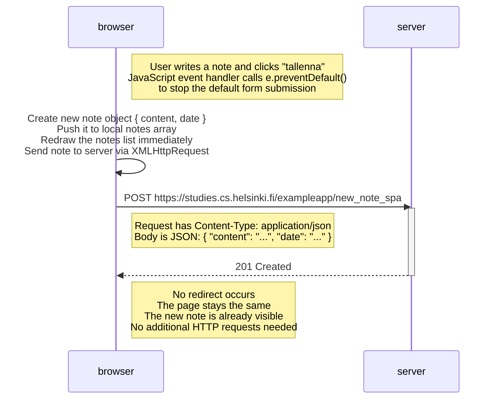

```mermaid
sequenceDiagram
    participant browser
    participant server

    Note right of browser: User writes a note and clicks "tallenna"<br/>JavaScript event handler calls e.preventDefault()<br/>to stop the default form submission

    browser->>browser: Create new note object { content, date }<br/>Push it to local notes array<br/>Redraw the notes list immediately<br/>Send note to server via XMLHttpRequest

    browser->>server: POST https://studies.cs.helsinki.fi/exampleapp/new_note_spa
    activate server
    Note right of browser: Request has Content-Type: application/json<br/>Body is JSON: { "content": "...", "date": "..." }
    server-->>browser: 201 Created
    deactivate server

    Note right of browser: No redirect occurs<br/>The page stays the same<br/>The new note is already visible<br/>No additional HTTP requests needed
```
